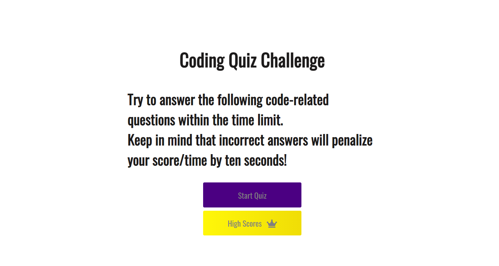
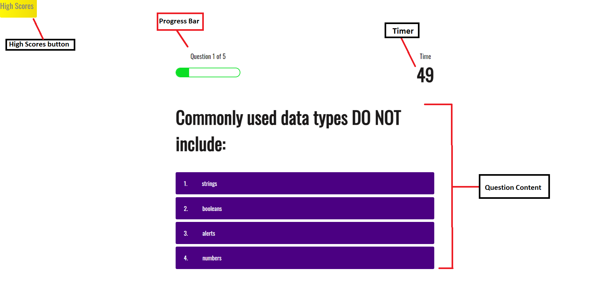
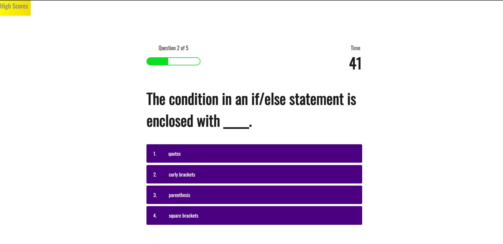
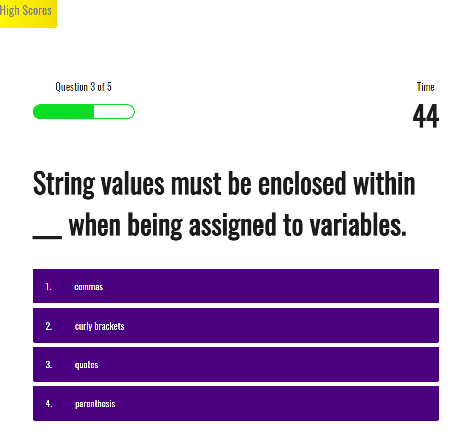
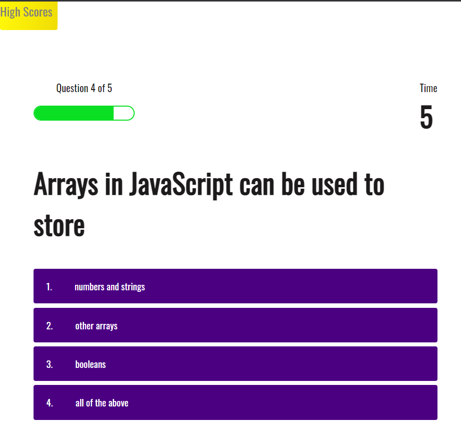
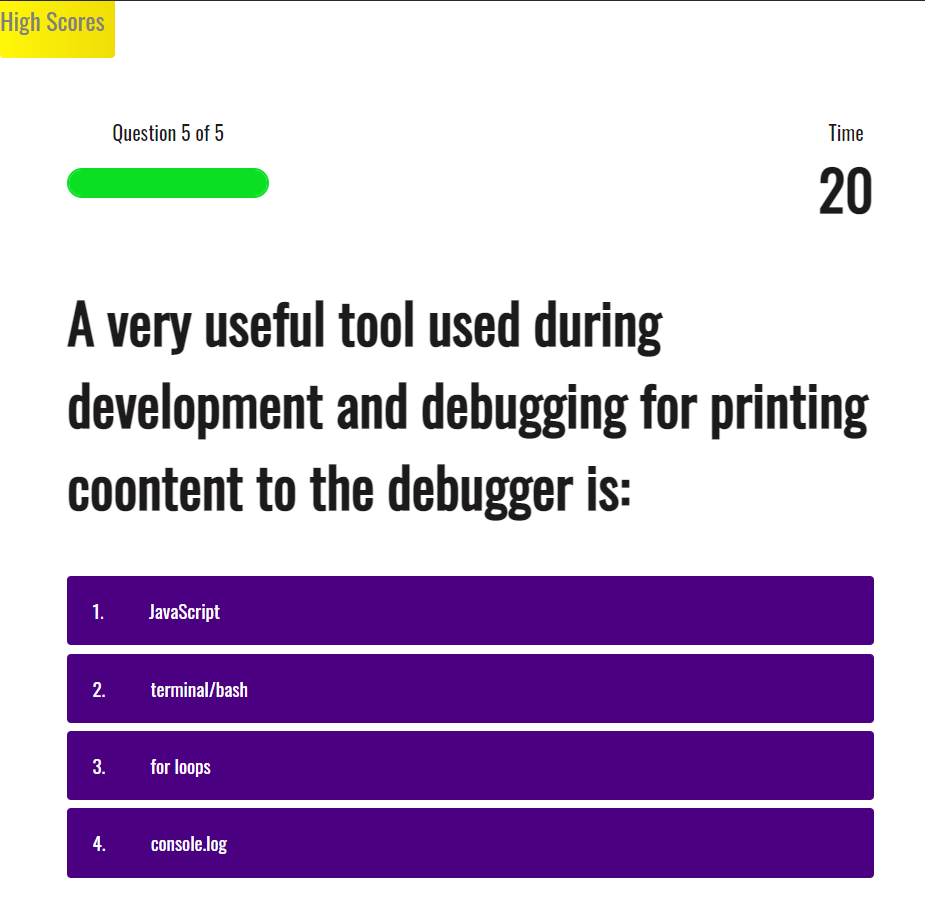
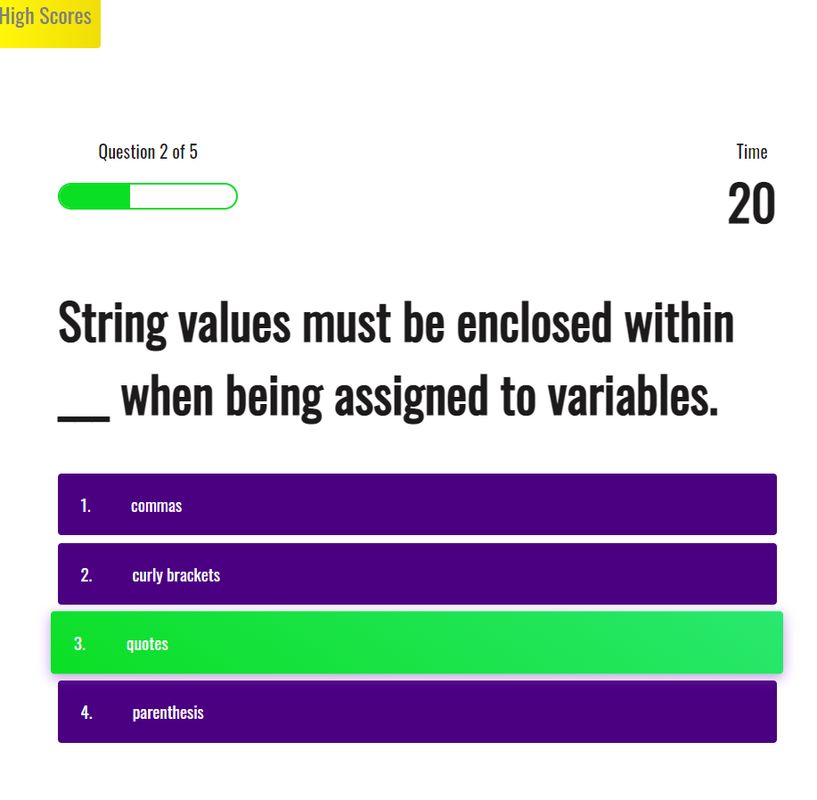
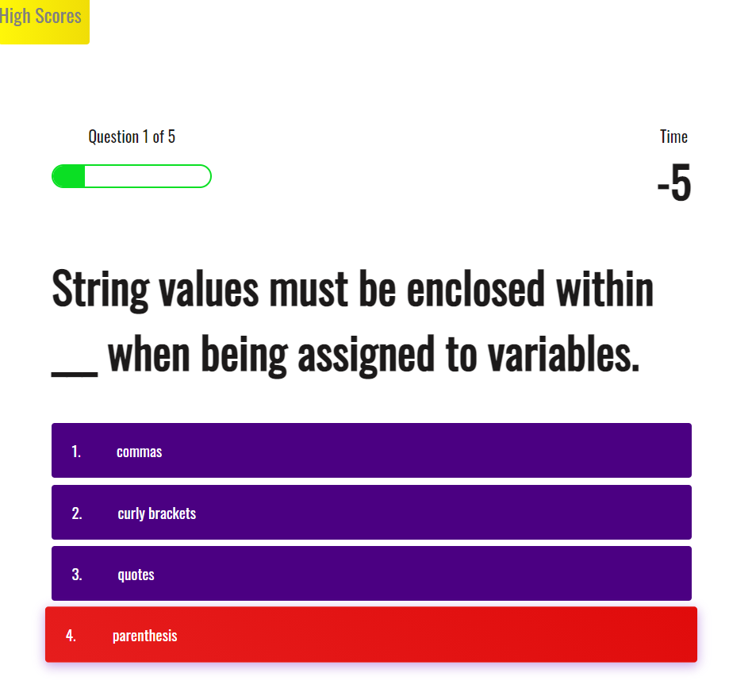
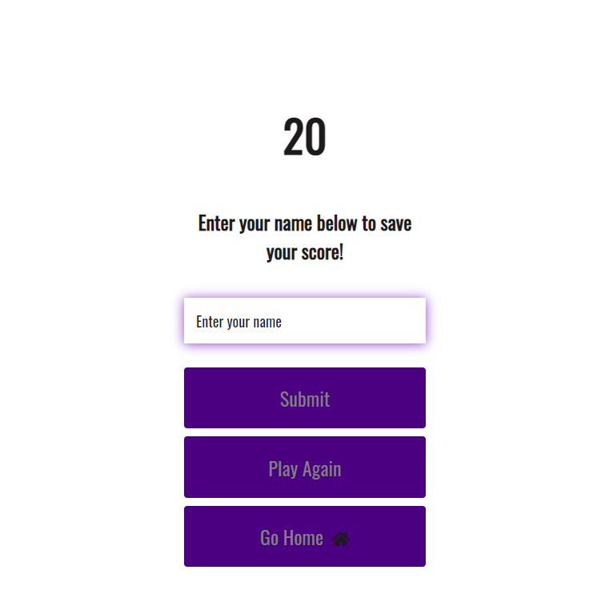
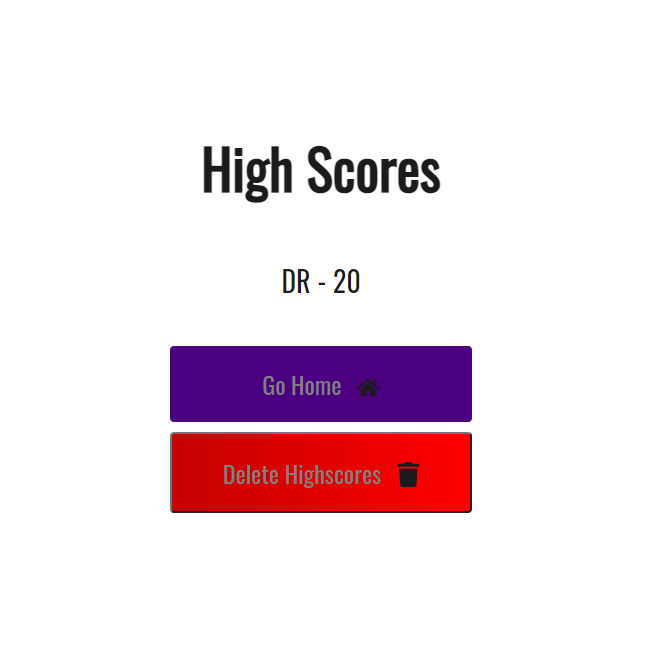

# _Web Developer Code Quiz_
> Web developer _Code Quiz_ that tests the basic knowledge of the developers.
> Live demo [_here_](https://darolo13.github.io/Code-Quiz/). 

## Table of Contents
* [Technologies Used](#technologies-used)
* [Features](#features)
* [Screenshots](#screenshots)
* [Project Status](#project-status)
* [Room for Improvement](#room-for-improvement)

## Technologies Used
- Tech 1 - JavaScript
- Tech 2 - CSS
- Tech 3 - HTML

## Features
Ready Features:
1. **Home page screen.**
2. **Quiz page section:**
- Correct Answers.
- Incorrect Answers.
- Each time the user is correct 10 points are added,
- Each time the user is wrong 5 points are subtracted.
3. **Progress Bar:**
- Each time the user passes a question the progress bar will get more of it's percentage covered 
4. **Timer:**
- If the time runs out the user will be redirected to the page where the username and highscore will be subitted.
5. **Delete highscores button:**
- If the user clicks the button the localStorage will be cleared and will be redirected to the home page.
6. **Random initial Question:**
- Each time the user restarts the page or enters a new game the initial question will be in a different order.

## Screenshots
### Code Quiz:

### Process example:
#### The user can choose one of the four posible answers:

#### Each time the user passes a question the progress bar gets covered:

#### If the user selects the correct option 5 points will be added:

#### If the user selects the wrong option 5 points will be subtracted:

#### When all the questions have been answered or the time runs out the user will be redirected to a page where the name will be displayed:

#### The user highscore and username will be displayed in the highscore page:

## Project Status
Project is: _in progress_

## Room for Improvement
Room for improvement:
- Time subtract
- Design

To do:
- Add Animations when the next question is going to display
- Improve design
- Fix time subtract bug
